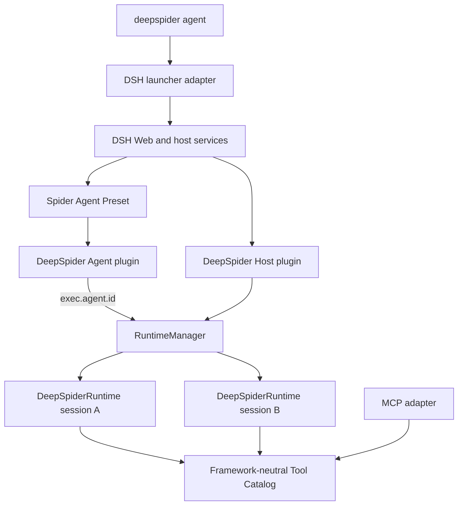

# DeepSpider Native DSH Integration Design

**Status:** agreed in conversation; pending written review

**Date:** 2026-08-14

**Scope:** replace OpenCode with a native DeepSeek Harness integration, support isolated concurrent sessions, and retain MCP as an external adapter

## Context

DeepSpider currently launches an OpenCode server, injects an Agent, Skill, plugin, and MCP subprocess, then attaches a TUI. Browser state lives in MCP process globals, and compaction recovery chooses the most recently modified task directory. Those assumptions make one active task the implicit global context and cannot safely support multiple sessions.

DeepSeek Harness (DSH) already provides the product shell DeepSpider needs: Web UI, model and credential management, event-sourced sessions, Agent lifecycle, scoped tools and prompts, permissions, Goals, skills, compaction, and plugin composition. DeepSpider should compose those facilities and contribute only its reverse-engineering runtime and tools.

The integration uses DSH's public Profile, Bundle/Patch, Preset, Cordis plugin, Service, event, and tool surfaces. It must not fork DSH or import unpublished internal source paths.

## Goals

- Make DSH the Agent and product runtime beneath DeepSpider.
- Keep `deepspider agent` as the startup command.
- Support multiple concurrent Spider sessions in one DSH process.
- Give every live session an isolated browser, CDP state, capture store, and output root.
- Close a session's browser when its Agent is disposed and close all browsers when the process exits.
- Register DeepSpider tools natively in DSH.
- Preserve `deepspider mcp` for external MCP clients without using MCP internally.
- Preserve the generic eight-stage workflow, immutable target execution, Hook-based environment analysis, and request-level verification.
- Follow current DSH releases without old-version compatibility branches.
- Require Node.js `>=24.0.0`.

## Non-goals

- OpenCode compatibility or settings migration.
- Node.js 20 or 22 support.
- DSH core changes or a maintained DSH fork.
- A custom replacement for DSH Web.
- General workflow, dynamic Cordis, or multi-agent orchestration in the first integration.
- Treating browser-acquired output as the final reverse-engineering deliverable.

## Architecture



DSH owns the product shell and durable conversation. DeepSpider owns the reverse-engineering runtime. The Tool Catalog is independent of DSH and MCP so neither adapter becomes the domain architecture.

## DSH composition

### Host Plane

The Host Plane contains process-wide or cross-session services:

- DSH Web, Agent registry, Session persistence, model routes, credentials, settings, permissions, tools, prompts, and projections.
- DSH Goal service and continuation driver.
- DSH Web search, shell, filesystem, jobs, and sandbox services.
- One `deepSpiderRuntimeManager` supplied by the DeepSpider Host plugin.

The manager is process-wide, but every managed state entry belongs to an exact Agent/Session.

### Agent Plane

The Spider Preset contributes:

- Spider persona and repository instructions.
- DeepSpider Skill discovery and loading.
- Shell, filesystem, search, and background-job tools.
- Goals.
- `web_search`; generic `web_fetch` is disabled.
- Ask User.
- Compaction and tool-result pruning.
- The DeepSpider Agent plugin and native tools.

Plan Mode, Subagents, Workflows, Ralph, Code Mode, generic Todo planning, and dynamic Cordis tools are excluded initially. A restricted static-analysis subagent may be designed after session isolation is proven.

DSH mounts a Preset generation once and multiple Agents join it through scope parentage. The Agent plugin is therefore stateless and must never keep a global current Session, Page, Frame, or script.

## Components

### `src/dsh/launcher.js`

- Resolve the real `dsh` entry from `@deepseek-ai/dsh/package.json` and `bin.dsh`.
- Start it with `process.execPath`, `shell: false`, the Web profile, and DeepSpider's patch.
- Set `DSH_HOME=~/.deepspider/dsh`.
- Default `DSH_PERMISSION_MODE` to `danger-full-access`.
- Supply package, preset, and session roots through explicit environment variables.
- Forward supported Web arguments, termination signals, and DSH stdout/stderr.
- Wait for DSH disposal so browser cleanup completes.

Default invocation:

```text
node <resolved-dsh-bin> web --patch <package>/dsh/cordis.patch.yml
```

DSH's default bind and port remain authoritative. `deepspider agent --port <port>` forwards a port; port `0` requests an available port.

### `src/dsh/host-plugin.js`

- Provide `ctx.deepSpiderRuntimeManager`.
- Listen for exact `agent/disposed` events and close only that Agent's Runtime.
- Dispose all Runtimes when the plugin or DSH process unloads.
- Register the DeepSpider checkpoint Session projection.
- Register no model-facing tools.

### `src/dsh/agent-plugin.js`

- Register the DeepSpider Tool Catalog in DSH's scoped registry.
- Resolve the caller through `exec.agent` and dispatch through RuntimeManager.
- Pass `exec.signal` through every asynchronous boundary.
- Append validated checkpoints when domain state changes.
- Contribute only stable identity and hard reverse-engineering invariants to the prompt.
- Register `evolve_skill`, writing learned knowledge under the DeepSpider DSH home.

It owns no browser, DataStore, frame, current task, or output directory.

### `src/dsh/session-state.js`

A pure module defining:

- The `deepspider/checkpoint` payload.
- Validation and normalization.
- Folding to the latest checkpoint.
- The projection shape used by DSH Web and prompt assembly.

It replaces mutable `session-state.md` discovery. Model-visible state must be reconstructible from the Session log.

### `dsh/cordis.patch.yml`

- Mount the Host plugin.
- Add the installed Spider Preset directory as a trusted root.
- Select `spider` as the default Preset.
- Configure only DeepSpider-specific Host differences.

Plugin rows use relative module specifiers resolved from the installed patch or Preset directory. The package may also declare the patch as a standard DSH Bundle, but `deepspider agent` requires no profile installation step.

### `dsh/agent-presets/spider/`

`agent.cordis.yml` declares the model-facing composition. `preset.yml` supplies display metadata. The directory contains no runtime state.

### `src/runtime/RuntimeManager.js`

The manager stores:

```text
SessionId -> { ownerAgent, runtimePromise, queue, abortController }
```

Rules:

- Runtime creation is lazy.
- Concurrent first calls for one Session share one promise.
- Failed creation cleans partial resources and removes the entry for retry.
- All DeepSpider tools in one Session are serialized.
- Different Sessions may execute in parallel.
- Disposal targets the exact Agent entry.
- `closeAll()` rejects new work, aborts active work, and awaits cleanup.

### `src/runtime/DeepSpiderRuntime.js`

One Runtime owns one live Agent's:

- SessionPaths and Session ID.
- BrowserClient and browser process.
- Page, selected Frame, CDP session, and execution context.
- Network, response, script, and WebSocket state.
- Session-scoped DataStore.
- Selected target script and rebuild context.
- Abort and cleanup lifecycle.

No module-level browser or current-task variables remain.

### `src/tools/catalog.js`

Each tool is declared once:

```js
{
  name,
  description,
  parameters,
  execute(runtime, args, signal)
}
```

DSH and MCP translate their protocol around this definition. A handler receives its Runtime explicitly and cannot find a global browser context.

## Session identity and storage

One DSH Session represents one reverse-engineering task. Its Agent uses the same Session ID.

```text
~/.deepspider/
├── dsh/
│   ├── profiles/
│   ├── settings.yaml
│   ├── .credentials.yaml
│   └── skills/
└── sessions/
    └── <full-sha256-of-session-id>/
        ├── session.json
        ├── data/
        ├── output/
        ├── rebuild/
        ├── screenshots/
        └── browser-data/
```

SessionPaths is the only module that derives these locations. Large scripts, bodies, traces, and screenshots stay on disk. Session events store small references with relative path, kind, SHA-256, and identity.

## Checkpoint contract

The first integration uses one complete small event:

```js
{
  type: 'deepspider/checkpoint',
  data: {
    phase: 'locate' | 'capture' | 'probe' | 'patch' | 'verify' | 'deliver',
    target: { url, scriptId, sha256 },
    artifacts: [{ kind, path, sha256 }],
    verification: { status, requestHash, resultPath }
  }
}
```

The latest valid checkpoint is current state. Low-level captures remain artifacts unless they affect the model-visible workflow. Dynamic prompt context is rendered from the checkpoint projection, never from the most recently modified directory.

## Reverse-engineering invariants

- The default deliverable is a direct, non-browser request implementation.
- Browser execution is an evidence source, not the default final solution.
- Decisions are generic and evidence based, without vendor or website exceptions.
- Captured target JavaScript is immutable; environment gaps are repaired through Hooks and environment scripts.
- Runtime probes conceal Node-specific host identity from target code.
- Verification covers method, URL, parameters, headers, cookies, body, response semantics, and independent reproducibility.
- A failed stage cannot silently become success or browser scraping.

The persona holds only stable identity and these invariants. The eight-stage workflow remains in the Skill.

## Enabled DSH capabilities

| Capability | Decision | Reason |
|---|---|---|
| Goals | Enabled | Sustains explicit long-running objectives. |
| Plan Mode | Disabled | Duplicates the DeepSpider phase workflow. |
| Subagents | Disabled initially | Child sessions cannot share a live browser Runtime. |
| Workflows | Disabled | Requires the subagent foundation and adds orchestration overhead. |
| Ralph | Disabled | Fresh Agents lose browser and Hook state. |
| `web_search` | Enabled | Supports public protocol, algorithm, and library research. |
| `web_fetch` | Disabled | Avoids presenting generic fetch as target-site reverse engineering. |
| Dynamic Cordis | Disabled | Can mutate the shared live Harness and is not a product capability. |

Goals are used only for an explicit persistent objective. A user stop request pauses the active Goal.

## Permission model

New sessions default to `danger-full-access`, combining unrestricted filesystem access with no approval prompts. DSH Web may change a Session's preset.

This does not weaken DeepSpider domain constraints: target immutability, Session isolation, path ownership, artifact hashes, and cleanup are enforced in code.

## Dependency and update policy

- `@deepseek-ai/dsh` and directly imported public DSH packages use `latest`.
- DeepSpider requires Node.js `>=24.0.0` with no older-Node branches.
- The lockfile remains a reproducible development snapshot, not a permanent DSH pin.
- Scheduled CI refreshes DSH and runs the full acceptance suite.
- Breaking changes are absorbed by the launcher, composition, or plugin adapters.
- Startup does not silently install framework updates; tested versions arrive through DeepSpider releases and `deepspider update`.
- Missing public DSH capabilities fail startup clearly.

## CLI surface

Retained:

```text
deepspider agent [--port <number>] [--verbose]
deepspider mcp
deepspider fetch <url>
deepspider update
deepspider --version
deepspider --help
```

Removed:

```text
deepspider agent --model <id>
deepspider config ...
```

Models, providers, and credentials are managed by DSH Web.

## OpenCode removal

Delete:

```text
src/agent/config.js
src/agent/opencode-binary.js
src/agent/runtime.js
src/agent/sandbox.js
src/agent/tui.js
plugins/deepspider-plugin/
agents/spider.md
src/cli/commands/config.js
```

Remove dependencies:

```text
@opencode-ai/sdk
@opencode-ai/plugin
opencode-ai
gray-matter
```

There is no legacy alias, settings migration, or fallback launcher.

## Migration sequence

1. **Runtime extraction:** introduce SessionPaths, DeepSpiderRuntime, and RuntimeManager; move MCP globals into a standalone Runtime while MCP continues to work.
2. **Tool Catalog extraction:** convert MCP tool groups into framework-neutral definitions and make MCP an adapter.
3. **DSH Host integration:** add the Host service, exact Agent disposal, Session paths, checkpoint event, and projection.
4. **DSH Agent integration:** add the Agent plugin, Spider Preset, persona, Skill, Goals, search, shell, files, jobs, Ask User, and compaction.
5. **Launcher and packaging:** replace the Agent command, publish the patch and Preset, require Node 24, and update CI and both READMEs.
6. **OpenCode deletion:** delete runtime code, dependencies, tests, and documentation, then regenerate the lockfile.

## Failure behavior

- Missing or incompatible DSH capabilities fail startup without fallback.
- Runtime creation failure cleans partial resources and is retryable.
- Cancellation reaches queue waiting, browser/CDP work, probes, and cleanup.
- A tool without an Agent fails explicitly.
- No tool chooses the latest Session or output directory as a fallback.
- Artifact integrity failure leaves the immutable source unchanged.
- One browser cleanup failure does not prevent cleanup of other Sessions.

## Verification

### Unit

- SessionPaths isolation and full-hash roots.
- Runtime creation deduplication, serialization, cross-session parallelism, cleanup, and retry.
- Exact Agent disposal and `closeAll()`.
- Checkpoint validation and folding.
- DSH and MCP dispatch through the same catalog.

### Composition

- `dsh web --patch ... --dump-config` resolves all DeepSpider rows.
- Spider Preset mount validation succeeds.
- Intended tools are present and excluded capabilities are absent.
- Defaults are `danger-full-access` and `spider`.

### Integration

- `deepspider agent` starts DSH Web.
- Two sessions use distinct Runtime objects, browsers, profiles, and artifact roots.
- Page, Frame, Network, WebSocket, script, and rebuild state do not cross sessions.
- Disposing one Agent closes only its browser; process exit closes all browsers.
- Resume restores checkpoint state and lazily creates a new Runtime.
- Goals and `web_search` are present; generic `web_fetch` is absent.
- MCP performs a real browser smoke through the shared catalog.

### Release

- Node 24 unit, lint, DSH, browser, and MCP suites pass.
- A packed tarball installs and runs from an empty directory.
- Installed Agent and MCP entrypoints work.
- The tarball contains the patch, Preset, Skill, adapters, tools, and runtime.
- No OpenCode dependency, source path, command, or documentation reference remains.

## Acceptance criteria

1. DSH Web is the only standalone Agent runtime.
2. One DSH Session maps to one isolated DeepSpiderRuntime and task directory.
3. Multiple sessions run concurrently without sharing browser or capture state.
4. Session disposal and process shutdown close the correct browsers.
5. DeepSpider tools are native DSH tools backed by a framework-neutral catalog.
6. MCP is only an external adapter over that catalog.
7. Checkpoint state is reconstructible from the Session log.
8. Goals and search-only research are enabled; excluded capabilities are absent.
9. Node.js `>=24.0.0` is enforced in metadata, CI, tests, and documentation.
10. OpenCode code and dependencies are completely removed.
11. Current DSH releases are continuously tested without compatibility branches.
12. Request-level delivery and immutable target guarantees remain intact.
