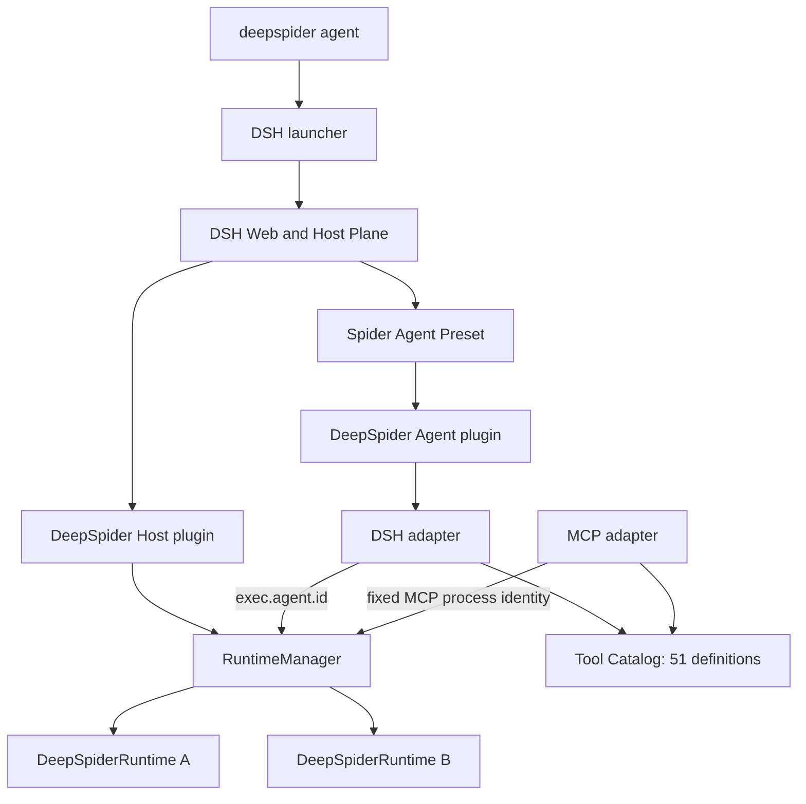

# DeepSpider Native DSH Integration Design

**Status:** design approved in conversation; written revision pending review

**Date:** 2026-08-14

**Scope:** replace OpenCode with a thin native DeepSeek Harness integration, support isolated concurrent sessions, and retain MCP as an external adapter

## Decision

DeepSeek Harness (DSH) owns the Agent product: Web UI, models, credentials, sessions, Goals, permissions, persistence, compaction, and standard Agent capabilities. DeepSpider owns only the reverse-engineering domain: browser/CDP state, evidence storage, immutable-target runtime analysis, and its 51 tools.

DeepSpider does not build a second session framework on top of DSH. The custom `deepspider/checkpoint` projection and `evolve_skill` are removed from the design. A resumed DSH Session keeps its durable conversation and tool history, then lazily creates a fresh browser Runtime.

This revision supersedes the original 14-task implementation plan after its Tasks 1–6. That plan will be replaced with the four remaining stages in this document after written review.

## Goals

- Keep `deepspider agent` as the startup command while replacing OpenCode with DSH Web.
- Support multiple concurrent DSH Sessions in one process.
- Give every Session an isolated Runtime, browser, CDP state, DataStore, and artifact root.
- Close one Session's browser on `agent/disposed` and close all browsers on process exit.
- Register all 51 DeepSpider tools natively in DSH.
- Keep `deepspider mcp` for external MCP clients over the same Tool Catalog.
- Preserve the generic reverse-engineering workflow, immutable target, Hook-based environment repair, Node-identity concealment, and request-level verification.
- Follow current DSH releases without old-version compatibility branches.
- Require Node.js `>=24.0.0` and pnpm `11.21.0`.

## Non-goals

- OpenCode compatibility or configuration migration.
- A custom Session checkpoint, projection, or browser-state restore format.
- Dynamic `evolve_skill` or package-source self-modification.
- Node.js 20 or 22 support.
- A DSH fork or imports from unpublished DSH source paths.
- Camoufox or a dual-browser abstraction.
- Vendor-specific or website-specific reverse-engineering routes.
- Exhaustive rare-edge-case handling.

## Architecture



The Tool Catalog is the domain boundary. DSH and MCP translate protocol inputs and outputs but do not contain browser or reverse-engineering logic.

## Host Plane and Agent Plane

### Host Plane

The Host Plane owns process-wide services:

- DSH Web, Agent registry, Session persistence, model routes, credentials, permissions, Goals, compaction, and standard tool services.
- One DeepSpider `RuntimeManager`.
- The DSH patch and Spider Preset registry.

The manager is process-wide only as an owner registry. Every map entry belongs to one exact `agent.id`.

### Agent Plane

The Spider Preset contributes model-facing behavior:

- DeepSpider persona, stable reverse-engineering invariants, and static Skill.
- DeepSpider's 51 native tools.
- Goals.
- Generic Todo.
- Code Mode.
- Cordis dynamic tools.
- `web_search`.
- Bash, filesystem, filesystem search, jobs, Ask User, compaction, and tool-result pruning.

The first release excludes:

- Plan Mode.
- Subagents.
- Workflows.
- Ralph.
- `web_fetch`.
- `evolve_skill`.

The Agent plugin is stateless. It must not store a current Agent, Runtime, browser, Page, Frame, DataStore, or task directory.

## Core components

### `src/runtime/SessionPaths.js`

`SessionPaths` is the only path derivation contract. It maps a full Session identity to a stable hashed root:

```text
~/.deepspider/sessions/<sha256(agent.id)>/
├── session.json
├── data/
├── output/
├── rebuild/
├── screenshots/
└── browser-data/
```

No component may infer identity from the newest or most recently modified directory.

### `src/runtime/RuntimeManager.js`

The manager stores:

```text
agent.id -> { ownerAgent, runtimePromise, queue, abortController }
```

Rules:

- Runtime creation is lazy.
- Concurrent first calls for one Session share one promise.
- Calls in one Session serialize.
- Different Sessions may run concurrently.
- `dispose(agent)` targets the exact Agent.
- `closeAll()` rejects new work, aborts active work, and awaits every Runtime cleanup.

### `src/runtime/DeepSpiderRuntime.js`

One Runtime owns one Session's:

- SessionPaths and Agent identity.
- BrowserClient and Patchright Chromium process.
- Page, selected Frame, CDP session, and execution context.
- Network, response, script, WebSocket, and debugger state.
- DataStore.
- Selected target and rebuild state.
- Abort and cleanup lifecycle.

No browser, DataStore, Page, Frame, CDP, or debugger state remains in module globals.

### `src/tools/catalog.js`

Each domain tool is declared once:

```js
{
  name,
  description,
  parameters,
  execute(runtime, args, signal)
}
```

The Catalog contains exactly the existing 51 DeepSpider tools. It does not add `evolve_skill`.

### `src/adapters/dsh-tools.js`

The DSH adapter:

- Creates native tools with the public `defineTool` API.
- Uses `exec.agent.id` as the Session identity.
- Dispatches through `RuntimeManager.run()`.
- Forwards `exec.signal`.
- Uses a JSON output schema and renders domain JSON without MCP envelopes.
- Returns stable domain errors when input, Session identity, or Runtime execution fails.

### `src/adapters/mcp-tools.js`

The MCP adapter exposes the same Catalog. One MCP server process uses one explicit synthetic identity and never borrows a DSH Session or searches for the latest task directory.

### `src/dsh/host-plugin.js`

The Host plugin:

- Provides one `RuntimeManager`.
- Listens to DSH's public `agent/disposed` event and disposes that exact Runtime.
- Calls `closeAll()` when its Cordis scope unloads.
- Registers no model-facing tools.
- Registers no custom projection.

### `src/dsh/agent-plugin.js`

The Agent plugin:

- Registers the 51 Catalog definitions through the DSH adapter.
- Contributes only stable DeepSpider prompt invariants.
- Uses the Host-provided RuntimeManager.
- Owns no mutable runtime state.
- Does not register `evolve_skill`.

### `dsh/cordis.patch.yml` and Spider Preset

The patch:

- Mounts the Host plugin.
- Adds the packaged Spider Preset root.
- Selects `spider` by default.

The Preset mounts the Agent plugin and only the approved DSH capabilities. It composes DSH's public plugins instead of copying their implementation.

### `src/dsh/launcher.js`

The launcher:

- Resolves the real `dsh` bin entry from the installed package manifest.
- Starts it with `process.execPath` and `shell: false`.
- Runs `dsh web --patch <packaged-patch>`.
- Defaults `DSH_PERMISSION_MODE=danger-full-access`.
- Forwards `--port`, including port `0`, and `--verbose`.
- On SIGINT/SIGTERM, stops DSH and awaits Host cleanup.

## Session lifecycle and data flow

```text
DSH tool call
  -> exec.agent.id
  -> RuntimeManager.run(agent, tool)
  -> exact DeepSpiderRuntime
  -> Browser / DataStore / Rebuild
  -> domain JSON
  -> DSH renderer
```

Lifecycle:

1. Creating a DSH Session does not eagerly launch a browser.
2. Its first DeepSpider browser operation lazily creates one Runtime.
3. All artifacts are written below that Session's root.
4. `agent/disposed` closes only that Runtime and browser.
5. Resuming the Session reuses its durable DSH log and artifact root but creates a fresh Runtime.
6. Process termination calls `closeAll()` and waits for browser cleanup.

Browser memory state is intentionally not restored. Pages, Frames, WebSockets, CDP sessions, and Hooks are captured again.

## Reverse-engineering invariants

- The default deliverable is a direct non-browser request implementation.
- Browser execution is evidence collection, not the default final result.
- Decisions are generic and evidence-based; no vendor or website special cases.
- Captured target JavaScript is immutable.
- Environment gaps are repaired with Hook and environment scripts.
- Runtime probes conceal Node-specific host identity from target code.
- Verification covers method, URL, parameters, headers, cookies, body, response semantics, and independent reproducibility.
- A failed reverse-engineering stage cannot silently degrade into browser scraping.

The prompt contains these stable invariants. The detailed eight-stage procedure remains in the static DeepSpider Skill.

## Capability decisions

| Capability | Decision |
|---|---|
| Goals | Enabled |
| Generic Todo | Enabled |
| Code Mode | Enabled |
| Cordis dynamic tools | Enabled |
| `web_search` | Enabled |
| `web_fetch` | Disabled |
| Plan Mode | Disabled |
| Subagents | Disabled |
| Workflows | Disabled |
| Ralph | Disabled |
| `evolve_skill` | Disabled |
| Custom DeepSpider checkpoint | Removed |

## Dependency policy

- `@deepseek-ai/dsh`: `latest`.
- `@deepseek-ai/dsh-tools`: `next`, because its current `latest` tag is still the older `0.0.1-rc.1` line while DSH uses `0.1.0-rc.6`.
- `@deepseek-ai/cordis`: `latest`.
- `@deepseek-ai/schemastery`: not a direct DeepSpider dependency. DSH may install it transitively for its own schemas.
- `pnpm-lock.yaml` records the tested dependency graph.
- Scheduled CI refreshes these tags in an ephemeral checkout and runs acceptance without committing automatically.
- No startup-time dependency installation and no old-DSH compatibility layer.

## CLI surface

Retained:

```text
deepspider agent [--port <number>] [--verbose]
deepspider mcp
deepspider fetch <url>
deepspider update
deepspider --version
deepspider --help
```

Removed:

```text
deepspider agent --model <id>
deepspider config ...
```

Models, providers, credentials, permissions, and active Sessions are managed through DSH Web.

## OpenCode removal

The final DSH launcher change removes all OpenCode-only code, plugins, Agent markdown, commands, tests, and dependencies. There is no fallback launcher, settings migration, alias, or compatibility layer.

## Failure behavior

- Missing required public DSH capabilities fail startup clearly.
- Runtime creation failure cleans its partial Runtime and allows a later retry.
- Cancellation propagates from DSH through the queue into browser and runtime operations.
- A tool call without an Agent identity fails explicitly.
- No tool falls back to a global browser or latest Session.
- One Runtime cleanup failure does not prevent other Runtimes from closing.
- Artifact integrity failure leaves the immutable target unchanged.

## Current implementation state

Completed and reviewed:

1. Node 24, pnpm 11, initial DSH dependencies, lockfile, and CI floor.
2. Pure SessionPaths contract.
3. RuntimeManager and DeepSpiderRuntime.
4. Browser, CDP, debugger, Network, WebSocket, and page-switch state isolation.
5. Framework-neutral Tool Catalog and MCP adapter.
6. Migration of 44 browser-facing tools.

Remaining work is intentionally compressed into four stages.

## Remaining implementation stages

### Stage 1: Finish Catalog and data ownership

- Migrate the remaining seven script, capture, and rebuild tools.
- Make DataStore an instance owned by DeepSpiderRuntime.
- Pass the DataStore explicitly into BrowserClient and interceptors.
- Remove the last legacy MCP registrations and DataStore singleton.
- Verify the Catalog exposes exactly 51 tools and two Runtimes cannot share paths or state.

### Stage 2: Native DSH integration

- Correct the DSH dependency tags and remove the Schemastery direct dependency.
- Add the minimal Host plugin.
- Add the DSH tool adapter and stateless Agent plugin.
- Wire exact `agent.disposed` cleanup and process-wide `closeAll()`.
- Verify 51 native tool registrations, Agent identity dispatch, cancellation forwarding, and cleanup.

### Stage 3: Preset, launcher, and OpenCode deletion

- Compose the Spider Preset with the approved capabilities.
- Add the packaged DSH patch.
- Replace the Agent launcher and preserve default YOLO mode.
- Delete OpenCode source, plugins, dependencies, commands, tests, and documentation references.
- Validate the resolved DSH configuration and packed binary layout.

### Stage 4: Product and release acceptance

- Update Chinese and English READMEs together.
- Add scheduled DSH dependency refresh and strengthen release CI.
- Run one real DSH Web startup and native tool smoke.
- Prove two Session identities map to different Runtime roots using controlled Runtimes.
- Run one real Patchright browser smoke and verify SIGTERM closes it.
- Run unit, lint, frozen install, packed install, and dry-pack checks.

No two-real-browser matrix, custom checkpoint replay suite, exhaustive lifecycle race suite, or old-version compatibility matrix is required.

## Acceptance criteria

1. DSH Web is the only standalone Agent runtime.
2. One DSH Session maps to one isolated DeepSpiderRuntime and artifact root.
3. Same-Session work serializes and different Sessions can overlap.
4. Session disposal closes its browser; process shutdown closes all browsers.
5. DSH and MCP dispatch through the same 51 Tool Catalog definitions.
6. The Spider Preset enables Goals, Todo, Code Mode, Cordis dynamic tools, and `web_search`.
7. The Spider Preset excludes `web_fetch`, Plan Mode, Subagents, Workflows, Ralph, and `evolve_skill`.
8. No custom DeepSpider checkpoint or Schemastery direct dependency remains.
9. OpenCode code and dependencies are removed without a compatibility layer.
10. Node.js `>=24.0.0` and pnpm `11.21.0` are consistent across manifest, CI, documentation, and packaging.
11. A real DSH startup, real Patchright operation, exit cleanup, and packed install pass.
12. Direct-request delivery and immutable-target guarantees remain enforced.
